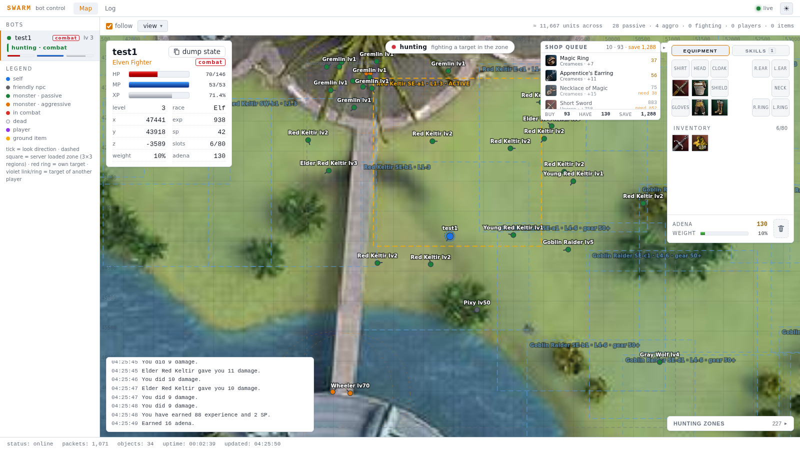
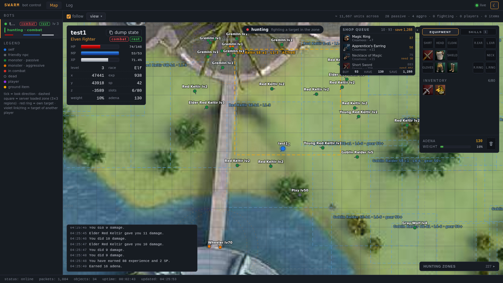
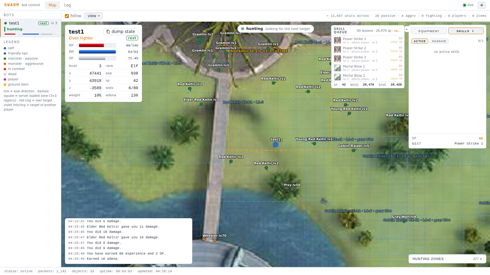
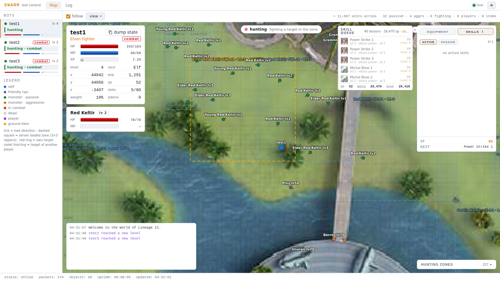
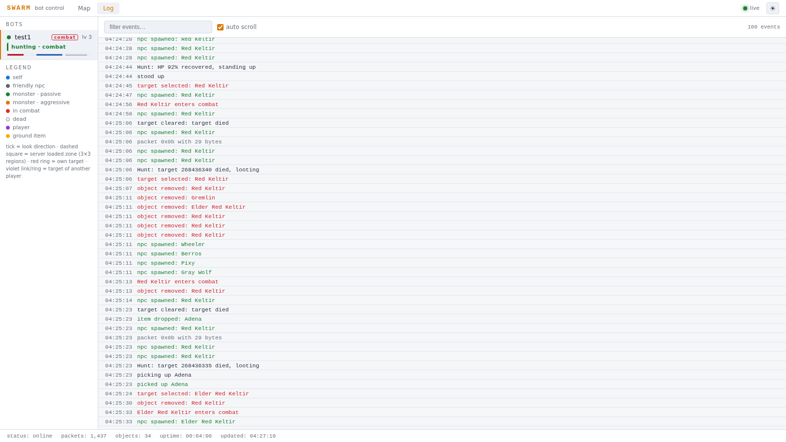

<!--
SPDX-FileCopyrightText: 2026 Melg Eight <public.melg8@gmail.com>

SPDX-License-Identifier: MIT
-->

# swarm

An out-of-game (OOG) botting tool for Lineage 2, written in Go. The bots
speak the client protocol directly - no game window, no screen scraping -
and farm a locally hosted
[L2J Mobius](https://gitlab.com/MobiusDevelopment/L2J_Mobius/) server
(the `L2J_Mobius_C1_HarbingersOfWar` module, Chronicle 1). One idempotent
script brings the whole playground up on a single Linux machine: the
emulator, its MariaDB database and the bot binary.

A session logs in (the account and the elven fighter character are
auto-created on the first run), enters the world and farms around the
clock. It picks targets and fights, loots, walks A* paths over the real
C1 geodata, walks into town for gear and consumables when the shopping
strategy says the adena is enough, delevels on purpose when it outgrows
its hunting zone, and reconnects with a growing backoff when a session
drops. The built-in web interface is where you watch it happen: the live
world map, the HUD, the equipment and skills, the shopping plan, the
combat log - plus manual commands for moments you want to steer. In proxy
mode a real C1 client can attach to the running bot character and take
over at any moment, with the bot still relaying every click.



## The web interface

`go run ./cmd/swarm -hunt -web 127.0.0.1:8080` serves the control view at
`127.0.0.1:8080`. What you see: the map of the current region built from
the real game tiles, every spawned NPC with name and level, the hunting
zone rectangle, the character HUD (HP/MP/XP, adena, inventory, weight),
the target panel of the current fight, the equipment paperdoll, the
planned purchases with prices, the combat chat and the raw session log.
Double click the map to move, attack or loot; drag bag items onto the
paperdoll to equip them. The `view` menu toggles map layers, the sun
button flips the theme.

<p>
  
  
</p>
<p>
  <em>The dark theme · the skills view: learned skills, the SP wallet and the queued lessons.</em>
</p>
<p>
  
  
</p>
<p>
  <em><code>-bots 3</code>: three sessions in one process, one sidebar · the log tab: spawns, combat, loot and town trips as they happen.</em>
</p>

## Quick start

Tested on Debian 13 x86_64. Needs bash, git and curl, about 2 GB of free
RAM, no root. The deploy script downloads JDK 25, MariaDB and Go 1.24 as
deb packages into `~/opt`, compiles the Mobius C1 server, imports the
75-table game database and builds the bot - about 90 seconds from a
clean state, and every step is skipped on re-runs.

```bash
bash tools/swarm_fast_deploy.sh      # the whole stack, ~90 s, idempotent
go run ./cmd/swarm -hunt -web 127.0.0.1:8080
```

The default account is `test1`/`test` (auto-created on first login).
Open `http://127.0.0.1:8080` - the map fills with NPCs within seconds
and the first kill lands within a minute.

Any Go 1.23+ toolchain works for `go run`. Without one, use the binary
the script built: it ends up at `${BASE}/logs/swarm_bot` (`BASE`
defaults to `/home/z/my-project`; the whole scratch tree - Mobius,
the database, the logs, the bot - lives under `BASE`, and the bot is
cloned from `SWARM_BRANCH`, default `main`, so the script works from a
fresh clone and without one):

```bash
BASE=~/swarm-stack SWARM_BRANCH=feature/proxy-server \
    bash tools/swarm_fast_deploy.sh
~/swarm-stack/logs/swarm_bot -hunt -web 127.0.0.1:8080
```

More run variants:

```bash
go run ./cmd/swarm -hunt -bots 3              # a fleet: test1, test2, test3
go run ./cmd/swarm -hunt -proxy               # + the C1 client proxy
go run ./cmd/swarm -pathfind-test             # the geodata pathfinder test UI
```

| Flag | Default | Meaning |
| --- | --- | --- |
| `-hunt` | off | the autonomous loop: attack, loot, gear, shop, delevel |
| `-bots` | 1 | concurrent sessions in one process (accounts are auto-created) |
| `-web` | `127.0.0.1:8080` | web interface address, empty disables it |
| `-proxy` | off | the MITM proxy for a real C1 client (see below) |
| `-login` | `127.0.0.1:2106` | login server address |
| `-account` / `-char` | `test1` / `test1` | account and character name |
| `-pathfind-test` | off | the geodata pathfinder test UI instead of the bot |

## The client proxy

```bash
go run ./cmd/swarm -hunt -proxy -web 127.0.0.1:8080
```

The swarm listens on the login and game ports a C1 client expects (the
`l2.ini` recipes are in [docs/proxy.md](docs/proxy.md)). A real game
client connects to the swarm as if it were the server; the bot keeps its
own session on the real server and relays everything between the two.
Watch the automated gameplay from the character's own perspective, then
start clicking - your input flows through the bot session to the real
server. The client even survives the bot's emergency relogins. With
`-bots 3`, the web UI picks which bot the client attaches to.

## Checks

```bash
tools/mobius_e2e.sh 45      # end to end: stack, bot in world, graceful shutdown, E2E_OK
task check:all              # golangci-lint + go test ./...
task test:cover             # coverage
task test:race              # the race detector (needs gcc)
```

`task` is [go-task](https://taskfile.dev); plain `golangci-lint run`
and `go test ./...` do the same job.

## Documentation

The subsystem docs live in [`docs/`](docs/README.md) - deployment,
hunting, shopping strategy, the web UI, pathfinding, the proxy, the wire
protocol, the development log. [`AGENTS.md`](AGENTS.md) holds the rules
and conventions of the repository; it is written for both humans and AI
coding agents, which is how this project is actually developed.

## License

MIT - see [license.md](license.md).
