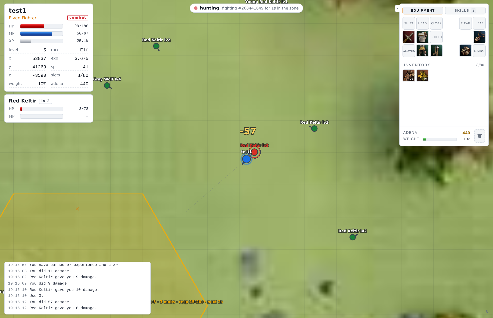
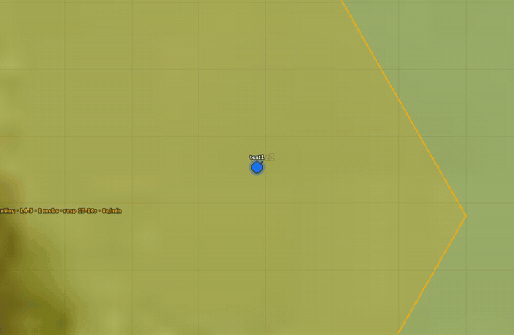
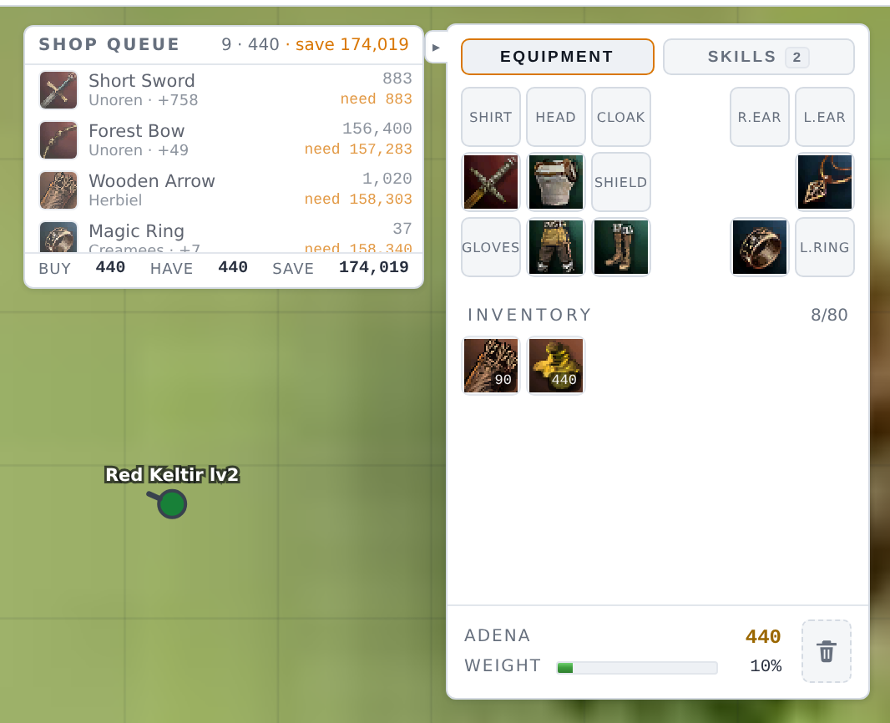
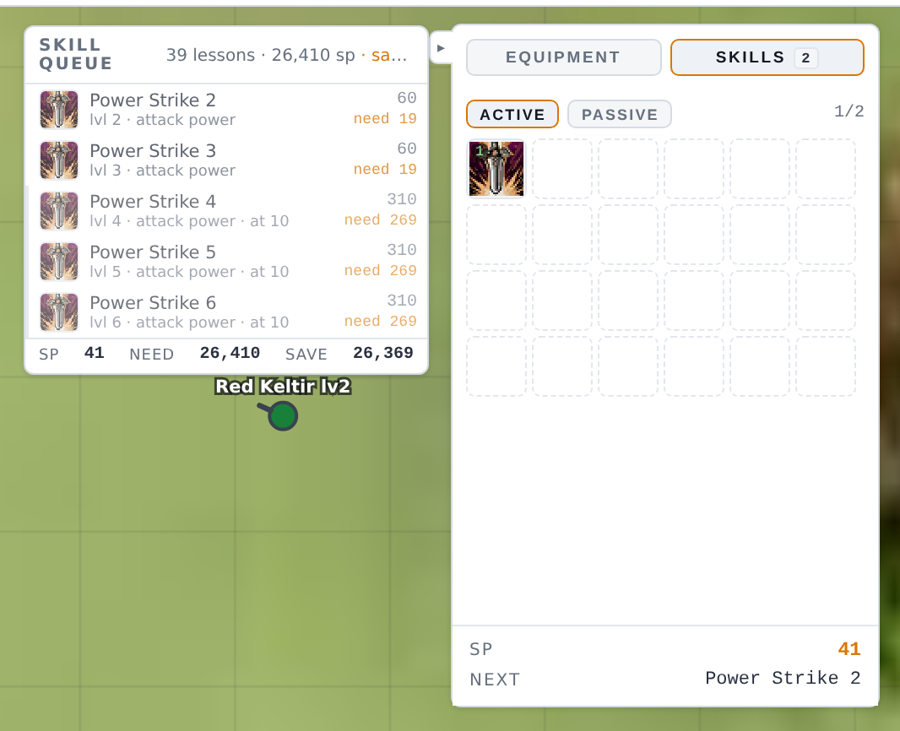
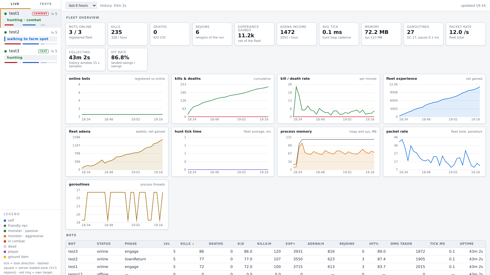
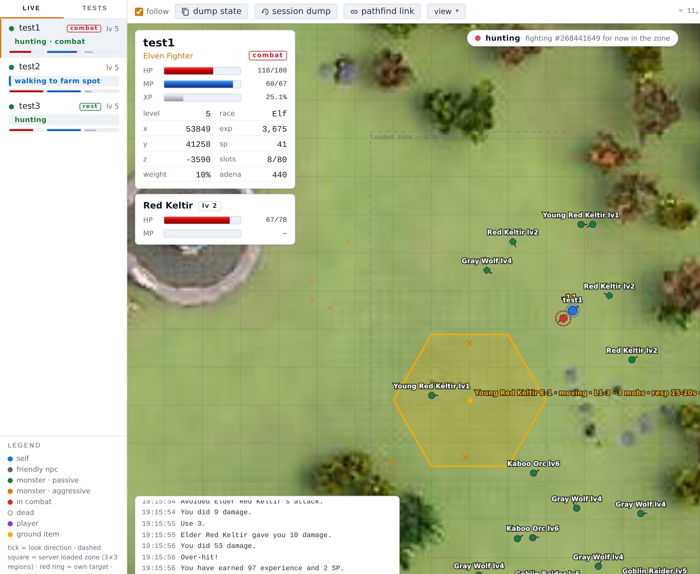
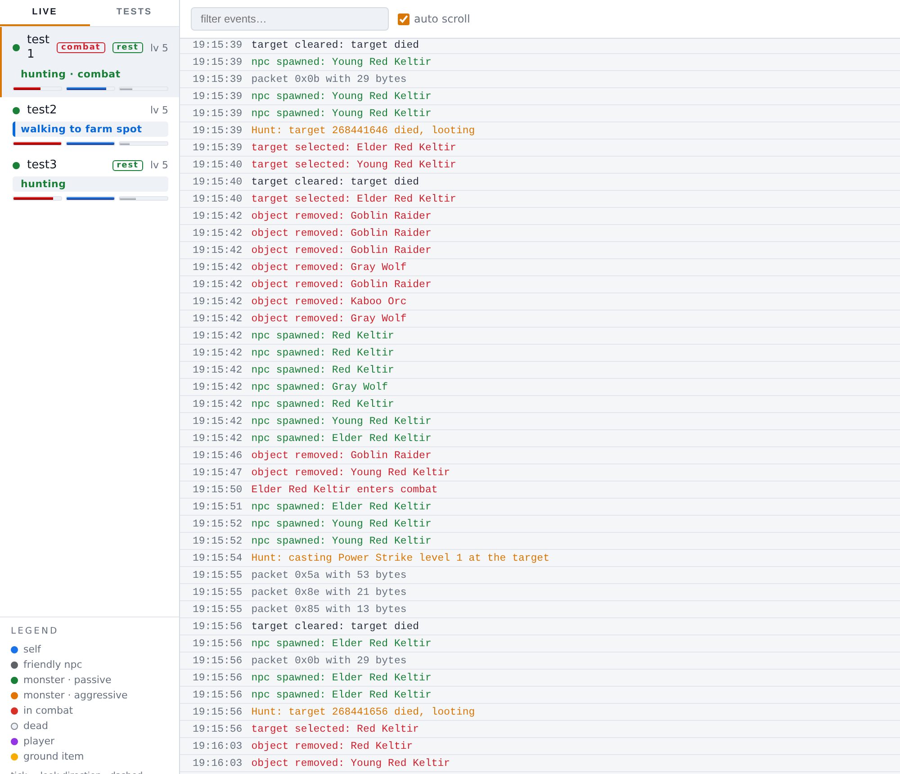
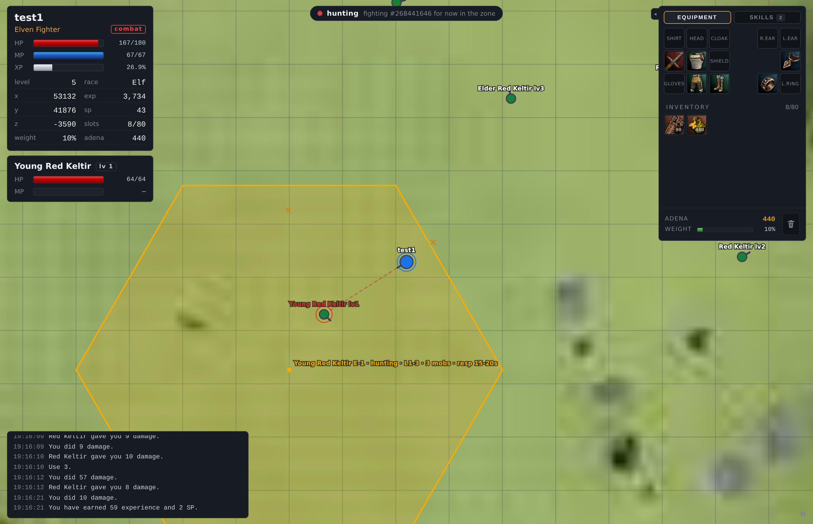

<!--
SPDX-FileCopyrightText: 2026 Melg Eight <public.melg8@gmail.com>

SPDX-License-Identifier: MIT
-->

# swarm

Control a Lineage 2 character from the browser.

**swarm** - is a headless client for Lineage 2, written in Go. It speaks
the game protocol directly - no game window, no screen reading, no input
emulation - and plays the character on its own: it picks targets and
fights, loots, sits down to regenerate, walks the routes of a
navigation mesh built from the real geodata, goes to town for gear and
consumables when the adena is enough, delevels on purpose when it
outgrows its spot, and reconnects with a growing backoff when a session
drops. Everything it does is visible in the built-in web interface, and
in proxy mode a real game client attaches to the running character and
takes over at any moment.

The playground fits one Linux machine: a single script brings up a local
[L2J Mobius][1] server (the `L2J_Mobius_C1_HarbingersOfWar` module,
Chronicle 1) with its MariaDB database and builds the client binary.

## Main goals of project

- Explore how far a game character can be driven over the wire protocol
  alone, with no screen and no emulated input

- Keep the whole playground on one machine - the server, the database,
  the client - so every experiment starts with a single command

- Learn Go on a subject area with concrete and unforgiving requirements:
  protocol cryptography, pathfinding over real geodata, long lived
  sessions, a live web interface

- Grow from one character to synchronized groups: parties farming raid
  bosses, cross party healing, in the end a whole alliance sieging a
  castle

## Features

- \[x] A live map of the world, built from the real game tiles: every
  spawned creature with name and level, the hunting cell the bot farms
  right now, the character HUD with HP/MP/XP, adena, weight and
  inventory, and the target of the current fight. The map plays the
  combat it observes: every landed swing draws its streak and impact,
  the damage floats over the hurt unit. Double click the map to move,
  attack or loot

  

  The hunt as the map plays it - the approach, the fight, the kill:

  

- \[x] The shopping strategy as a visible plan: the equipment paperdoll,
  the prices, the adena wallet, what is bought next and what waits for
  the money. Cheap armor fills the empty slots first, the weapon
  milestone follows, the jewelry waits behind both. Drag bag items onto
  the paperdoll to equip them yourself

  

- \[x] The skill plan: the learned skills, the SP wallet and the queued
  lessons, attack power first (the learning itself is not wired to the
  server yet)

  

- \[x] The statistics of the whole fleet: the kills, deaths, experience
  and adena history charts, the hit rate, the per bot comparison table
  and the phase timelines - the long run picture a 24/7 deployment
  needs

  

- \[x] Several sessions in one process, each on its own auto created
  account, all in one sidebar with their vital bars and current activity

  

- \[x] The raw event stream of a session - spawns, combat, loot, town
  trips, relogs - with a text filter and auto scroll

  

- \[x] A dark theme for the whole interface

  

- \[x] The mesh pathfinding over the real C1 geodata, height and
  collision aware: the tiles build from the geodata region by region
  (`go run ./cmd/navmesh-build -regions 21_19` covers the elven start,
  a full world pass is gigabytes), the long hunt routes serve from the
  mesh with the water priced at the swim rate, and the 3D navmesh
  viewer (`-show-navmesh`) renders the world with the route searches -
  drag the start and the end markers and watch the search. The grid
  engine stays the click validation and local walk layer

- \[x] The client proxy: a real Chronicle 1 client connects to the swarm
  as if it were the server, the session stays alive on the real server,
  and every click of yours flows through it. The attached client even
  survives emergency relogins - see [docs/proxy.md](docs/proxy.md)

## Current status

This project is under development, expect changes in the run flags, the
web interface and the protocol coverage. Only the parts of the protocol
the gameplay needs are implemented - the client grows with the features
instead of ahead of them. The whole loop runs on the elven fighter the
first login creates. You can fork it and play with it, contributions,
issues and requests are welcome.

## Getting Started

Tested on Debian 13 x86_64. Needs bash, git and curl, about 2 GB of
free RAM, no root. The whole playground stands in three steps:

1. Clone and bring the stack up:

   ```bash
      git clone https://github.com/melg8/swarm.git
      cd swarm
      bash tools/swarm_fast_deploy.sh
   ```

   The script downloads JDK 25, MariaDB and Go as deb packages into
   `~/opt`, compiles the Mobius server, imports the 75-table game
   database and builds the client - about 90 seconds from a clean state,
   and every finished step is skipped on re-runs. The whole tree (the
   server, the database, the logs, the binary) lives under `BASE`,
   `/home/z/my-project` by default; the sources it builds are cloned
   from `SWARM_BRANCH`, `main` by default, so the script works from a
   checkout of any branch and without a clone at all

1. Run the client:

   ```bash
      go run ./cmd/swarm -hunt -web 127.0.0.1:8080
   ```

   Any Go 1.23+ toolchain works. Without one, run the binary the script
   built: `${BASE}/logs/swarm_bot -hunt -web 127.0.0.1:8080`

1. Open `http://127.0.0.1:8080`. The account `test1`/`test` and the
   elven fighter are created on the first login, the map fills with
   creatures within seconds, and the first kill lands within a minute

## Usage

The web interface is the main way to use swarm. The sidebar selects
the session, the map shows the world, the floating panels hold the
HUD, the target, the equipment and the skills. Interact with the
world directly: double click the map to move, attack or loot, drag
inventory items onto the paperdoll to equip them. The `view` menu
toggles the map layers, the sun button flips the theme, the `log`
tab shows the raw event stream, the `stats` tab the fleet
statistics.

The run variants:

```bash
   go run ./cmd/swarm -hunt -bots 3     # three sessions: test1, test2, test3
   go run ./cmd/swarm -hunt -proxy      # plus the client proxy
   go run ./cmd/swarm -pathfind-test    # the geodata pathfinder test UI
   go run ./cmd/swarm -show-navmesh     # the 3D navmesh viewer
```

| Flag | Default | Meaning |
| --- | --- | --- |
| `-hunt` | off | the autonomous loop: attack, loot, gear, shop, delevel |
| `-bots` | 1 | concurrent sessions in one process, accounts are created on the fly |
| `-web` | `127.0.0.1:8080` | web interface address, empty disables it |
| `-proxy` | off | the client proxy for a real C1 client |
| `-login` | `127.0.0.1:2106` | login server address |
| `-account` / `-char` | `test1` / `test1` | account and character name |
| `-pathfind-test` | off | the geodata pathfinder test UI |
| `-show-navmesh` | off | the 3D navmesh viewer of the mesh pathfinder |

Run with `-h` for the rest: the fight FX galleries, the geodata and
passability overrides, the proxy ports.

The stack around the client is handled by two more commands:

```bash
   tools/mobius_start.sh        # start the login and the game server
   tools/mobius_e2e.sh 45       # end to end: stack, session in the world,
                                # graceful shutdown, E2E_OK
```

## Checks

```bash
   task check:all               # golangci-lint + go test ./...
   task test:cover              # coverage
   task test:race               # the race detector (needs gcc)
```

`task` is [go-task][2]; plain `golangci-lint run` and `go test ./...`
do the same job.

## The stack

- **the game** - [L2J Mobius][1] - MIT - the Chronicle 1 server, the
  geodata, the map tiles

- **the storage** - [MariaDB][3] - GPLv2 - the game database

- **the language** - [Go][4] - BSD 3-Clause - the client itself (the
  module targets go 1.23.2, the `go.mod` toolchain line pins go1.26.8)

- **the tasks** - [go-task][2] - MIT - the check recipes

## Planned

- Parties farming raid bosses, cross party healing, an alliance sieging
  a castle - the long goal of the project

- The next hunting bands beyond the elven lands (the 20-40 band is
  surveyed in [docs/band_20_25_survey.md](docs/band_20_25_survey.md);
  the hexagon cell system of [docs/hunting_cells.md](docs/hunting_cells.md)
  is the ground model)

- Wiring the queued skill lessons to the server

## Documentation

- [docs/README.md](docs/README.md) - the index of the subsystem docs:
  deployment, hunting, the shopping strategy, the web interface,
  pathfinding, the proxy, the wire protocol, the development log

- [AGENTS.md](AGENTS.md) - the rules and conventions of the repository

## License

MIT - see [license.md](license.md).

[1]: https://gitlab.com/MobiusDevelopment/L2J_Mobius/

[2]: https://taskfile.dev

[3]: https://mariadb.org

[4]: https://go.dev
