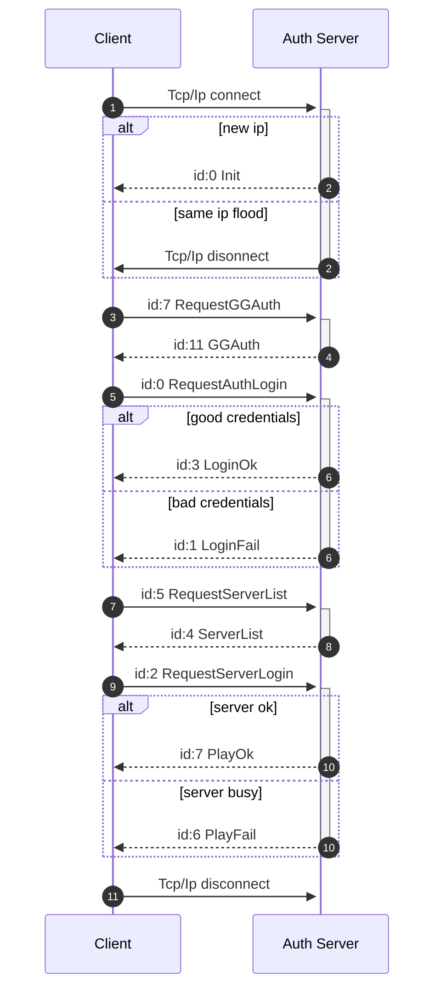

<!--
SPDX-FileCopyrightText: 2026 Melg Eight <public.melg8@gmail.com>

SPDX-License-Identifier: MIT
-->

# Description of client-server protocol

> **Currency note.** This document was originally written against the
> l2j-lisvus emulator and still carries its vocabulary in the login
> section. The current reference server of the project is **Mobius C1
> (`L2J_Mobius_C1_HarbingersOfWar`, game protocol version 419)**; the
> Mobius Java sources are authoritative wherever the two disagree.
> The behavioral summary the packet work actually builds on (framing,
> flows, equip semantics, shop and logout protocol, vanilla quirks)
> lives in the "Protocol notes (Mobius C1)" section of AGENTS.md.
> Treat the lisvus-specific detail below as historical background.

Description client-server communication protocol based on [L2JLisvus](https://gitlab.com/TheDnR/l2j-lisvus/) server emulator.


# Authentification

Game servers have at least two differrent revisions of auth server protocol c621 and 785a. l2j-lisvus uses c621 which is described below.



Process of handling recieved packets:
1. Check recieved raw data length and compare it with expected packet length from data[2] field.
2. If raw data is smaller then expected length, read tcp/ip again and concatenate data
3. Decrypt packet if packet expected to be encrypted
4. Check packet checksum, discard packet if checksum is invalid
5. Check packet type, discard packet if type is not expected in current state of authentification
6. Deserialize body of packet into concrete data structure
7. Use data structure in next state of authentification
    

## Auth server -> client packets


### 0. Packets common structure
Packets have similar structure to eachother. They consist of:
   

| Hex | Size | Bytes | Enc | Description |
|-----|------|-------|-----|-------------|
|XX XX|2|[0-1]| |Size of packet|
|XX |1|[2]| 🔓 |Id of packet|
|XX XX XX XX .. |N|[3-(N+2)]| 🔓|Body of packet|
|00 .. |0-4|[(N+3)-(N+6)]| 🔓|Padding with zeroes for 8 byte alignment of packet|
|XX XX XX XX |4|[(N+7)-(N+10)]| 🔓| Checksum (only auth server communications) |


There are 6 different types of data that can be passed in packet

| Hex | Size | Type description |
|-----|------|-------------|
|XX XX XX .. \0|N|string UTF8|
|XX XX XX XX ..|8|float|
|XX XX XX XX ..|8|int 64|
|XX XX XX XX|4|int 32|
|XX XX|2|int 16|
|XX|1|int 8|


Auth server packets are encrypted using [Blowfish](https://en.wikipedia.org/wiki/Blowfish_(cipher)) algorithm with 21 bytes hardcoded key:
```
5F 3B 35 2E 5D 39 34 2D 33 31 3D 3D 2D 25 78 54 21 5E 5B 24 # Actual key
00 # End of key indicator
```


## Auth server -> client packets


### 1. [Init](https://gitlab.com/TheDnR/l2j-lisvus/-/blame/main/core/java/net/sf/l2j/loginserver/serverpackets/Init.java#L19)
----

| Hex | Size | Description | Bytes |
|-----|------|-------------|-------|
| 00 | 1 | [Type](https://gitlab.com/TheDnR/l2j-lisvus/-/blame/main/core/java/net/sf/l2j/loginserver/serverpackets/Init.java#L43) | [0] |
| XX XX XX XX |  4 | [Session ID](https://gitlab.com/TheDnR/l2j-lisvus/-/blame/main/core/java/net/sf/l2j/loginserver/serverpackets/Init.java#L44) | [1 - 4] |
| 21 C6 00 00| 4 | [Protocol revision](https://gitlab.com/TheDnR/l2j-lisvus/-/blame/main/core/java/net/sf/l2j/loginserver/serverpackets/Init.java#L45) | [5 - 8] |
| XX XX XX XX ... | 128| [RSA Public Key](https://gitlab.com/TheDnR/l2j-lisvus/-/blame/main/core/java/net/sf/l2j/loginserver/serverpackets/Init.java#L47)| [9 - 136] |
| 29 DD 95 4E | 4 | [GG related](https://gitlab.com/TheDnR/l2j-lisvus/-/blame/main/core/java/net/sf/l2j/loginserver/serverpackets/Init.java#L50) | [137 - 140] |     
| 77 C3 9C FC | 4 | [GG related](https://gitlab.com/TheDnR/l2j-lisvus/-/blame/main/core/java/net/sf/l2j/loginserver/serverpackets/Init.java#L51) | [141 - 144] |          
| 97 AD B6 20 | 4 | [GG related](https://gitlab.com/TheDnR/l2j-lisvus/-/blame/main/core/java/net/sf/l2j/loginserver/serverpackets/Init.java#L52) | [145 - 148] |     
| 07 BD E0 F7 | 4 | [GG related](https://gitlab.com/TheDnR/l2j-lisvus/-/blame/main/core/java/net/sf/l2j/loginserver/serverpackets/Init.java#L53) | [149 - 152] |
| XX XX XX XX ...| 20 | [Blowfish key (Only if compatibility mode enabled)](https://gitlab.com/TheDnR/l2j-lisvus/-/blame/main/core/java/net/sf/l2j/loginserver/serverpackets/Init.java#L57) | [153 - 172] |
| 00 | 1 | [End of key indicator (Only if compatibility mode enabled)](https://gitlab.com/TheDnR/l2j-lisvus/-/blame/main/core/java/net/sf/l2j/loginserver/serverpackets/Init.java#L58) | [173] |

Example of raw full Init packet, notice total length of packet is 159 bytes caused by 2 bytes with size of packet at beginning of packet and 4 bytes with padding at the end of packet. Server sends this packet unencrypted and without
checksum:
```diff
0000:|9f 00|00|b8 cd 6b 8b|21 c6 00 00|2e ac d4 98 2c  .....k.!.......,
0010: 71 bb 2f a7 6f 1d af 58 7c fd d3 c2 6d c4 f4 c4  q./.o..X|...m...
0020: 2b 9f 3b 09 42 c7 8c 72 e9 7d 03 bf 24 4b df d2  +.;.B..r.}..$K..
0030: 85 64 88 58 dc 8c f6 a6 ac 78 cc 75 5b ae 3d 7b  .d.X.....x.u[.={
0040: 18 ec 5e e1 d5 48 13 1c 00 63 d2 02 1f 35 f5 34  ..^..H...c...5.4
0050: 35 1d d6 90 8f 34 e3 3c d4 ed f9 83 55 b4 61 3b  5....4.<....U.a;
0060: 73 1d a2 4f 1b 3e 71 c3 af 0c 14 b8 1c 2f bf 64  s..O.>q....../.d
0070: 66 06 e5 77 4f 26 fe b8 da b3 2c c5 55 68 37 e5  f..wO&....,.Uh7.
0080: 9f 65 84 c3 93 71 0e 35 f3 15 59|4e 95 dd 29|fc  .e...q.5..YN..).
0090: 9c c3 77|20 b6 ad 97|f7 e0 bd 07|00 00 00 00     ..w ...........
Size: 159 bytes
```

Parsed Init packet:
```
InitPacket:
  SessionID: 8b6bcdb8
  ProtocolVersion: 0000c621
  RsaPublicKey:
    2eacd4982c71bb2fa76f1daf587cfdd3
    c26dc4f4c42b9f3b0942c78c72e97d03
    bf244bdfd285648858dc8cf6a6ac78cc
    755bae3d7b18ec5ee1d548131c0063d2
    021f35f534351dd6908f34e33cd4edf9
    8355b4613b731da24f1b3e71c3af0c14
    b81c2fbf646606e5774f26feb8dab32c
    c5556837e59f6584c393710e35f31559

  GameGuard1: 29dd954e
  GameGuard2: 77c39cfc
  GameGuard3: 97adb620
  GameGuard4: 07bde0f7
  BlowfishKey: nil
```


### 2. [GGAuth](https://gitlab.com/TheDnR/l2j-lisvus/-/blob/main/core/java/net/sf/l2j/loginserver/serverpackets/GGAuth.java#L24)

----

| Hex | Size | Description | Bytes |
|-----|------|-------------|-------|
| 0B | 1 | [Type](https://gitlab.com/TheDnR/l2j-lisvus/-/blob/main/core/java/net/sf/l2j/loginserver/serverpackets/GGAuth.java#L45) | [0] |
| XX XX XX XX |  4 | [Session ID](https://gitlab.com/TheDnR/l2j-lisvus/-/blob/main/core/java/net/sf/l2j/loginserver/clientpackets/RequestAuthGG.java#L81)| [1 - 4] |
| 00 00 00 00 |  4 | [Unknown](https://gitlab.com/TheDnR/l2j-lisvus/-/blob/main/core/java/net/sf/l2j/loginserver/serverpackets/GGAuth.java#L47)| [5 - 8] |


## Client -> auth server packets

### 1. [RequestGGAuth](https://gitlab.com/TheDnR/l2j-lisvus/-/blame/main/core/java/net/sf/l2j/loginserver/clientpackets/RequestAuthGG.java#L23)


| Hex | Size | Description | Bytes |
|-----|------|-------------|-------|
| 07 | 1 | [Type](https://gitlab.com/TheDnR/l2j-lisvus/-/blob/main/core/java/net/sf/l2j/loginserver/L2LoginPacketHandler.java#L55) | [0] |
| XX XX XX XX | 4 | [Session ID](https://gitlab.com/TheDnR/l2j-lisvus/-/blame/main/core/java/net/sf/l2j/loginserver/clientpackets/RequestAuthGG.java#L25) | [1 - 4] |
| 23 92 90 4D | 4 | [Data 1](https://gitlab.com/TheDnR/l2j-lisvus/-/blame/main/core/java/net/sf/l2j/loginserver/clientpackets/RequestAuthGG.java#L26) | [5 - 8] |
| 18 30 B5 7C | 4 | [Data 2](https://gitlab.com/TheDnR/l2j-lisvus/-/blame/main/core/java/net/sf/l2j/loginserver/clientpackets/RequestAuthGG.java#L27) | [9 - 12] |
| 96 61 41 47 | 4 | [Data 3](https://gitlab.com/TheDnR/l2j-lisvus/-/blame/main/core/java/net/sf/l2j/loginserver/clientpackets/RequestAuthGG.java#L28) | [13 - 16] |
| 05 07 96 FB | 4 | [Data 4](https://gitlab.com/TheDnR/l2j-lisvus/-/blame/main/core/java/net/sf/l2j/loginserver/clientpackets/RequestAuthGG.java#L29) | [17 - 20] |


### 2. [RequestAuthLogin](https://gitlab.com/TheDnR/l2j-lisvus/-/blob/main/core/java/net/sf/l2j/loginserver/clientpackets/RequestAuthLogin.java#L31)
| Hex | Size | Description | Bytes |
|-----|------|-------------|-------|
| 00 | 1 | [Type](https://gitlab.com/TheDnR/l2j-lisvus/-/blob/main/core/java/net/sf/l2j/loginserver/L2LoginPacketHandler.java#L65) | [0] |
| 00 00 00 00 ... | 89 | [Padding](https://gitlab.com/TheDnR/l2j-lisvus/-/blob/main/core/java/net/sf/l2j/loginserver/clientpackets/RequestAuthLogin.java#L45) | [1 - 90] |
| 24 | 1 | [Account Start Flag](https://gitlab.com/TheDnR/l2j-lisvus/-/blob/main/core/java/net/sf/l2j/loginserver/clientpackets/RequestAuthLogin.java#L52) | [91] |
| 00 00 | 2 | [Padding](https://gitlab.com/TheDnR/l2j-lisvus/-/blob/main/core/java/net/sf/l2j/loginserver/clientpackets/RequestAuthLogin.java#L52) | [92 - 93] |
| XX XX XX XX ... | 14 | [Account](https://gitlab.com/TheDnR/l2j-lisvus/-/blob/main/core/java/net/sf/l2j/loginserver/clientpackets/RequestAuthLogin.java#L82) | [94 - 107] |
| XX XX XX XX ... | 16 | [Password](https://gitlab.com/TheDnR/l2j-lisvus/-/blob/main/core/java/net/sf/l2j/loginserver/clientpackets/RequestAuthLogin.java#L83) | [108 - 124] |
| 00 00 | 2 | [Padding]() | [125 - 127] |


## Steps of packet assembly
- RegisterNewPacket(packetID int32, packetSize int32)
    - reserve 2 bytes for packet size
    - set packet id to proper value for each packet
- Write...(...)
    - insert packet data
- Assemble()
    - reserve 0-7 bytes for padding depending on current size to be 8 byte aligned
    - calculate size of packet and insert to first 2 bytes
    - claculate checksum from packet id to end of packet - 4 bytes
    - insert checksum to last 4 bytes
    - encrypt from 2 to end
- Packet()


# Game server packets added by swarm

Reference implementation: the Mobius C1 sources
(`L2J_Mobius_C1_HarbingersOfWar/java/org/l2jmobius/gameserver`). Game packets
are framed by a 2 byte little endian size header followed by
`[opcode: 1][body]`, encrypted with the stateful XOR cipher, integers are
little endian.

## Client -> game server packets

### RequestActionUse (0x45)

The action button packet. Action id 0 toggles sit/stand; the server refuses
to sit while moving, casting or attacking (`RequestActionUse.runImpl` case 0,
`Player.sitDown`/`standUp`). The bot uses it to rest at low HP.

| Offset | Size | Field |
|--------|------|-------|
| 0 | 1 | Opcode 0x45 |
| 1 | 4 | Action id (0 = sit/stand toggle) |
| 5 | 4 | Ctrl pressed (0/1) |
| 9 | 1 | Shift pressed (0/1) |

### MoveToLocation (0x01)

The ground click movement request of the official client: the server walks
the character to the target point (`MoveToLocation.runImpl`). Mode 1 is the
mouse click; keyboard mode (0) is ignored unless keyboard movement is
enabled on the server. The hunt loop walks to a drop with it before
clicking the item.

| Offset | Size | Field |
|--------|------|-------|
| 0 | 1 | Opcode 0x01 |
| 1 | 4 | Target X |
| 5 | 4 | Target Y |
| 9 | 4 | Target Z |
| 13 | 4 | Origin X (client side position) |
| 17 | 4 | Origin Y |
| 21 | 4 | Origin Z |
| 25 | 4 | Movement mode (1 = mouse) |

### Appearing (0x30)

The teleport confirmation of the official client: the server keeps the
character in the teleporting state after every self TeleportToLocation
(`Creature._isTeleporting`) until this packet arrives
(`Appearing.runImpl` -> `Player.onTeleported`). While the flag is set
every move request is silently ignored by the character AI
(`isMovementDisabled`), so a village revive without the confirmation
leaves the character permanently stuck. The bot sends it right after
applying its own teleport. No body.

| Offset | Size | Field |
|--------|------|-------|
| 0 | 1 | Opcode 0x30 |

### RequestSellItem (0x1E)

Sells inventory items to a merchant. The bot (like the official client
selling from the inventory) sends list id 0, the `CUSTOM_CB_SELL_LIST`
of `RequestSellItem.runImpl`: the server prices every item itself at
`referencePrice/2`, skips items it refuses to sell, answers with
InventoryUpdate removals, ItemList, a CUR_LOAD StatusUpdate and the
"transaction is complete" SystemMessage, and adds the adena. With list
id 0 the server skips the merchant target and buy list checks
entirely, so the transaction lands from anywhere; the bot still walks
to the merchant and selects it like the official client.

| Offset | Size | Field |
|--------|------|-------|
| 0 | 1 | Opcode 0x1E |
| 1 | 4 | Sell list id (0 = inventory sell) |
| 5 | 4 | Item count |
| 9 | 12×n | Entries: object id (4), item id (4), count (4) |

The `TransactionFloodProtector` paces the requests (10 s by default).

## Game server -> client packets

### ChangeWaitType (0x3F)

Announces the sit/stand transition of a creature
(`ChangeWaitType.writeImpl`, enum values 0 = sitting, 1 = standing). The
broadcast goes through `Player.broadcastPacket`, so the acting client
receives its own transitions; it is the confirmation the hunt loop waits
for before ever sending the opposite toggle.

| Offset | Size | Field |
|--------|------|-------|
| 0 | 1 | Opcode 0x3F |
| 1 | 4 | Object id |
| 5 | 4 | Move type (0 = sitting, 1 = standing) |
| 9 | 4 | X |
| 13 | 4 | Y |
| 17 | 4 | Z |

### SkillList (0x6D)

The full learned skill list of the character (`SkillList.writeImpl`):
sent on entering the world and after every skill learn. The bot parses
it into the tracker skill map (the web UI renders the learned skills
of the equipment widget and computes the learning queue from it). The
snapshot entries of `skills` and `skillPlan.entries` also carry the
`desc` field - the classic client tooltip text of the level, resolved
from the level comment runs the generated dictionary extracted out of
the Mobius C1 skill stats (`npcdata.SkillDescription`).

| Offset | Size | Field |
|--------|------|-------|
| 0 | 1 | Opcode 0x6D |
| 1 | 4 | Skill count |
| 5 | 12 | Per skill: passive flag (0/1), level, skill id |

### GetItem (0x17) position semantics

`GetItem` carries the position of the ITEM, not of the picker
(`Item.pickupMe` writes the item location; the official client only
animates the item flying into the inventory). The picker position is
already known from the StopMove broadcasts of the arrival, so the tracker
must not snap the picker to these coordinates - it teleported the marker
across the map on every pickup.

# The proxy emulation (swarm -> C1 client)

The emulated servers of the client proxy (`internal/swarm/proxy`, see
docs/proxy.md) speak the same wire formats with additions noted here.
The login emulation is a full state machine mirror of the Mobius
LoginPacketHandler (any credentials pass, GGAuth 0x07 gets the legacy
0x0B answer `[opcode 0x0B][sessionId: 4][0: 4]`), so only the packets
the proxy SYNTHESIZES (instead of relaying recorded bytes) are listed.

### Login Init (0x00, proxy variant)

The proxy Init mirrors the real packet byte for byte
(`loginserver/network/serverpackets/Init.java`): the scrambled RSA
modulus is copied from the Init packet the BOT received on its own
login (`AuthResult.RsaPublicKey`), so the client accepts it like the
real one. The session id is random per client connection, the protocol
revision is 0x0000c621, no trailing Blowfish key.

### ServerList (0x04, proxy variant)

One entry: server id 1, the IPv4 the client used to reach the login
listener (`conn.LocalAddr`), the proxy game port, status up, brackets
off, current players = the connected client count.

### CharSelectionInfo (0x1F, proxy variant)

Exactly one character: the played character of the selected bot
session. The appearance block (sex, race, base class, hair, face) is
re-serialized from the LAST recorded real char list of the session that
contains the played name (full fidelity for the character screen
render), while the vitals, the position and the level come from the
live tracker (fresher than the login time list). Sp/exp are written as
zeros (the parser never stored them). The paperdoll object ids of the
15 slots come from the last UserInfo broadcast of the bot session (the
server refreshes the block on every equip and unequip) and the item
ids are resolved through the tracked inventory - the C1 client renders
the selection screen model from the item id table, so the slots must
carry the real equipped gear.

### KeyPacket (0x00, proxy variant)

Same layout as the real one, but the key is the STATIC Mobius C1
session key (`94 35 00 00 a1 6c 54 87`, the real `GameClient.CRYPT_KEY`)
and the server id is 1: the real C1 client build stays compatible with
a hardcoded key (Mobius never rotates it), so a random per connection
key desynchronized the real client and is forbidden. The client cipher chain starts from
this key; the bot session keeps its own chain from the real server key
- the two chains advance independently, which is the property the
packet transformer seam builds on (rewriting, resizing, dropping and
injecting stay cipher safe).

### CharCreateFail (0x26, proxy answer)

The emulation answers creation attempts with reason 0x01 ("too many
characters"): the emulated account offers exactly the one served
character, the real account is never touched by client login phase
packets.

### The relay model

After the client EnterWorld the proxy sends the recorded stream of the
bot session (every packet after the bot's CharSelected, sequence
numbers keep the order) and then continues with the live feed. Every
client packet from the char selected state onward transits to the real
game server through `GameClient.SendRaw` (the same outbound cipher
critical section the hunt loop uses). The client's move request
`[opcode 0x01][targetX/Y/Z][originX/Y/Z][mode: INT 4 bytes]` (mode 1 =
mouse, 0 = keyboard - a full int, see MoveToLocation.readImpl) is the
reference example covered by the E2E.

The recorded packets that describe the played character itself are
patched to the LIVE tracker state before the replay (the world packets
of other objects replay unchanged):

- the CharSelected answer is binary-patched with the live x/y/z,
  curHp/curMp, sp, exp and level (the byte offsets are scanned from
  the two utf16 strings and the header ints; an unscannable packet
  replays unchanged),
- every replayed UserInfo of the played character carries the live
  position, vitals, level and progression,
- the movement family packets of the played character
  (MoveToLocation 0x01, MoveToPawn 0x75, StopMove 0x59,
  ValidateLocation 0x76, TeleportToLocation 0x38) are dropped except
  the newest one - its coordinates are exactly the tracker position
  because the tracker takes its position from that packet.

This is what makes a reconnection after the bot walked away correct:
the client spawns where the character actually stands instead of the
login-time place (the stale spawn ran into the server-side walls and
crashed the real client).
