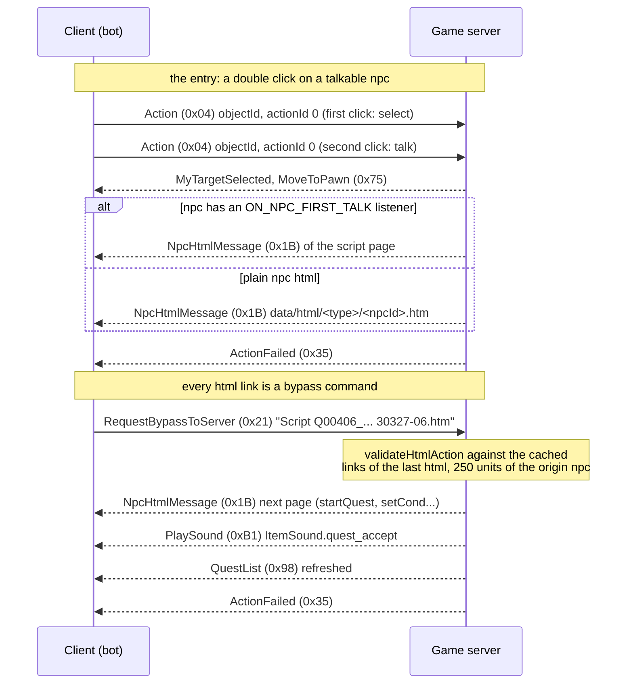

<!--
SPDX-FileCopyrightText: 2026 Melg Eight <public.melg8@gmail.com>

SPDX-License-Identifier: MIT
-->

# The quest subsystem protocol (Mobius C1)

> Research document of BACKLOG T-004 (M2, the first profession). Every
> statement below is read from the Mobius C1 sources
> (`L2J_Mobius_C1_HarbingersOfWar`, game protocol version 419) and,
> where marked **[live]**, observed against the deployed local stack
> (2026-09-12, the trace round of this task). The packet framing,
> the string encoding and the cipher are those of
> `docs/protocol_description.md` and the AGENTS.md protocol notes:
> little endian integers, null terminated UTF-16LE strings, the
> stateful XOR game cipher. This document is the quest/dialog half
> the class transfer work (M2) builds on; no bot code exists for it
> yet (the follow-up task list closes the document).

## The engine at a glance

The quest engine lives in
`java/org/l2jmobius/gameserver/mechanics/script/`:

- `Quest` (`Quest.java`) - one Java script instance per quest, named
  `Q00xxx_NameOfQuest` (the directory name under
  `dist/game/data/scripts/quests/`). The `ScriptManager` registers
  them by name; the quest id (406, 407, ...) is the numeric prefix.
- `QuestState` (`QuestState.java`) - the per player progress of one
  quest: the state byte, the variables map and the derived `cond`.
- `State` (`State.java`) - the three quest states:
  `CREATED = 0`, `STARTED = 1`, `COMPLETED = 2`.
- Village masters and other NPC logic scripts (no quest id, no
  quest journal entry) are plain `Script` (`Script.java`) classes -
  the class change script of the elven fighters is one.

A quest script announces its NPC and mob interests in the
constructor (`Quest.java`):

| Registration | Event listener | Fires when |
| --- | --- | --- |
| `addStartNpc(ids)` | `ON_NPC_QUEST_START` | the NPC dialog opens (sets the last quest npc) |
| `addTalkId(ids)` | `ON_NPC_TALK` | a `Script <name>` bypass reaches the NPC |
| `addFirstTalkId(ids)` | `ON_NPC_FIRST_TALK` | the first double click on the NPC |
| `addKillId(ids)` | `ON_ATTACKABLE_KILL` | the mob dies (see the 2.5 s delay below) |
| `addAttackId(ids)` | `ON_NPC_ATTACK` | the mob is attacked |

`registerQuestItems(ids)` marks the quest item ids: they are removed
from the inventory when the quest exits and are listed separately in
the `QuestList` packet (the items themselves arrive through the
ordinary inventory packets).

## The dialog flow (the packet sequence)

A dialog round trip - the same protocol the shop trips and the
lessons already ride, plus the quest pages on top:



**[live]** A fresh bot that never sends a single dialog packet still
receives the whole html stream of its town trips: during one
merchant sell round the server pushed one `NpcHtmlMessage` (813
bytes) about every second for a full minute - the store dialog the
buy/sell transactions re-open - while the bot drops all of them on
the floor (the 0x1b lines of the 2026-09-12 trace round,
`SWARM_TRACE_PACKETS=1`). The dialog layer is not optional traffic;
it is the backbone every npc interaction answers with.

## Client -> game server packets

### Action (0x04) - the talk entry

Already implemented (`internal/swarm/packets/to_game_server/actions.go`,
used by the lesson and merchant flows of the hunt loop). Wire format
(see `network/clientpackets/Action.java`):
`[opcode 0x04][objectId: 4][originX: 4][originY: 4][originZ: 4]
[actionId: 1]` with `actionId` 0 for the simple click.

The talk semantics (`scripts/handlers/actions/click/NpcClick.java`):
the first click on an npc only selects it (target set,
`MyTargetSelected`); the second click with the same object id and
`interact` set walks the interact branch. A talkable npc within the
`Npc.INTERACTION_DISTANCE` (250 units) answers with `MoveToPawn`
(0x75) and then either the `ON_NPC_FIRST_TALK` script page or the
static html `data/html/<type>/<npcId>.htm`; a hostile npc becomes an
attack intention instead. Outside the 250 units the player AI walks
toward the npc first - the bot already replicates the click-from-
the-ring behavior in its teacher leg (hunt/learning.go).

### RequestBypassToServer (0x21) - the dialog command channel

Wire format (see `network/clientpackets/RequestBypassToServer.java`):
`[opcode 0x21][command: string]` - one UTF-16LE null terminated
command.

The command grammar the quest flow needs (the dispatch order of
`RequestBypassToServer.runImpl`):

- `npc_<objectId>_<sub>` - NPC bound commands: `npc_81801_Chat 3`
  (page 3 of the npc html), `npc_81801_Script Q00406_...` (the
  quest choose window link form), `npc_81801_SkillList`,
  `npc_81801_BuyList ...`, `npc_81801_Sell`-family (the shop
  commands the hunt loop knows). Routed through
  `Npc.onBypassFeedback` -> `BypassHandler` when the npc is within
  250 units.
- bare `Script <name> [<event>]` - the quest page commands the quest
  html files carry (`bypass Script Q00406_PathOfTheElvenKnight
  30327-05.htm`, `bypass -h Script ElfHumanFighterChange1 19`).
  Routed through the `BypassHandler` to
  `scripts/handlers/bypass/npc/ScriptLink.java`: with a script name
  and an event it calls `Player.processScriptEvent` ->
  `Quest.notifyEvent(event, npc, player)`; with a name only it
  calls `Quest.notifyTalk`.
- bare `Chat <page>` - the npc html page links
  (`scripts/handlers/bypass/npc/ChatLink.java`).

Every command passes the validation gate first (the html action
cache section below): the exact command string (after stripping the
optional `-h ` prefix) must be cached from a server-sent html, and
the origin npc of that html must be within 250 units. An unmatched
command is silently dropped (a `PacketLogger` warning only for
empty strings); a matched but far-origin command is dropped without
any answer. The flood protector `canUseServerBypass` also paces the
bypass rate.

### RequestQuestList (0x63)

Empty body (`network/clientpackets/RequestQuestList.java`): the
server answers with a fresh `QuestList` (0x98) snapshot. The client
uses it to refresh the quest journal after relogging.

### RequestQuestAbort (0x64)

`[opcode 0x64][questId: 4]` (`network/clientpackets/
RequestQuestAbort.java`): resolves the quest by id and calls
`QuestState.exitQuest(true)` - the repeatable exit that deletes the
`character_quests` rows, removes the registered quest items and
resends `QuestList`. Not needed by the bot until a quest must be
restarted.

### RequestLinkHtml (0x20) - the plain html file links

`[opcode 0x20][link: string]` (`network/clientpackets/
RequestLinkHtml.java`): opens `data/html/<link>` in a dialog. Only
the static tutorial pages use it; the quest flow does not need it
(the cached action form is `link <file>`).

## Game server -> client packets

### NpcHtmlMessage (0x1B) - the dialog page

Wire format (see `network/serverpackets/NpcHtmlMessage.java` and its
base `AbstractHtmlPacket.java`):

```
[opcode 0x1B][npcObjId: 4][html: string][itemId: 4]
```

- `npcObjId` - the npc the dialog belongs to (0 for npc-less html);
  the bot must remember it: it is the origin object id of every
  bypass the page carries.
- `html` - the full page source; `%playername%` is replaced before
  sending, `%objectId%` appears inside the links.
- `itemId` - non zero only for item bound dialogs (the quest flow
  keeps it 0).

**[live]** 813 bytes observed for the merchant store pages (an
about 400 character html plus the 9 byte envelope - consistent with
the layout above).

Every arrival also rewrites the client side action cache
(`AbstractHtmlPacket.runImpl` -> `HtmlUtil.buildHtmlActionCache`):
the `NPC_HTML` scope cache is cleared and the bypasses of the new
page are cached with the npc origin. A `ActionFailed` (0x35) always
follows the html (the client etiquette packet; the bot tolerates it
already).

### QuestList (0x98) - the quest journal

Wire format (see `network/serverpackets/QuestList.java`):

```
[opcode 0x98][questCount: 2]
  per quest: [questId: 4][state: 4]
[itemCount: 2]
  per quest item: [objectId: 4][itemId: 4][count: 4][bodyPart: 4]
```

The `state` int is the quest condition number (`cond`) of a started
quest, or the completion flags mask (`__compltdStateFlags` variable)
of a quest with completed paths. A quest with no `QuestState` (never
touched) does not appear at all. The quest items section repeats the
inventory stacks of registered quest items (they still arrive
through the ordinary `InventoryUpdate`/`ItemList` packets first).

**[live]** the empty form is 5 bytes (`[1][2:0][2:0]`) and it is
pushed automatically at world entry: `EnterWorld.java` line 303
sends `new QuestList(player)` right after the character enters -
the trace round observed exactly that (0x98 with 5 bytes at the
enter world second, before any client request). The bot does not
need `RequestQuestList` to learn the quest state at login.

The same packet is re-sent by the server on every quest state
change (`QuestState.setState`, `QuestState.set` of the `cond`
variable, `exitQuest`) and by `RequestQuestAbort`/`RequestQuestList`
- the journal is a push protocol, the client never polls.

### PlaySound (0xB1) - the quest jingles

Wire format (see `network/serverpackets/PlaySound.java`):
`[opcode 0xB1][unknown1: 4][soundFile: string][unknown3: 4]
[unknown4: 4][x: 4][y: 4][z: 4][unknown8: 4]`. The quest sounds of
`QuestSound.java`: `ItemSound.quest_accept` (the quest start),
`ItemSound.quest_middle` (a `setCond` bump), `ItemSound.quest_itemget`
(a kill drop), `ItemSound.quest_finish`. The bot can parse only the
sound file name and use it as a cheap progress signal - the same
way the C1 client flashes the journal icon.

### MoveToPawn (0x75)

`[opcode 0x75][objectId: 4][targetId: 4][distance: 4][x: 4][y: 4]
[z: 4]` - the "npc turns to you" preamble of every dialog open
(`NpcClick` sends it right before the html). Cosmetic for the bot;
listed because it precedes every `NpcHtmlMessage` and must not be
mistaken for a movement order of the own character.

## The html action cache (the anti-injection gate)

The bypass commands are not free-form: the server only accepts
commands that a server-sent html actually offered.

- Every `NpcHtmlMessage` arrival clears the scope cache and caches
  the actions parsed from the html
  (`HtmlUtil.buildHtmlBypassCache`): every `action="bypass ..."`
  attribute (the optional `-h ` prefix stripped) becomes a cached
  command; a `$` in the command marks a variable parameter - the
  cache keeps the command up to and including the first `$` and
  validates any command with that prefix.
- `RequestBypassToServer`/`RequestLinkHtml` call
  `Player.validateHtmlAction(command)`: an exact match (or the `$`
  prefix match) against any scope cache entry passes and returns
  the origin npc object id of the html; a miss drops the packet
  silently.
- A validated command whose origin npc is farther than 250 units is
  dropped silently as well (the "walked away with the dialog open"
  case).
- The scopes (`HtmlActionScope`): `NPC_HTML` (quest and npc pages -
  the cache holds only the LAST page; a new html replaces it),
  `NPC_ITEM_HTML`, `COMM_BOARD_HTML` and the tutorial scopes.

The bot consequence: it must mirror this cache client side - keep
the last received html page (per scope) with its npc origin, and
send only bypasses that page offered, standing within 250 units of
the origin npc. Sending a guessed bypass (for example a hardcoded
`Script ElfHumanFighterChange1 19`) is dropped unless the currently
open page actually carries that link. The one exception: the
`npc_<objId>_...` family is validated the same way - the object id
prefix is part of the cached command string.

## The quest state machine and the persistence

The lifecycle of a quest for one character:

1. **CREATED**: the quest state exists (the journal row) but the
   quest has not started. `notifyTalk` answers with the first quest
   page (the `onTalk` `CREATED` branch - for Q00406 the page
   `30327-01.htm` with the "say you want to be an Elven Knight"
   link).
2. **STARTED**: `startQuest()` (the accept link of the first page,
   for Q00406 `30327-06.htm`) sets `cond = 1`, switches the state,
   plays `quest_accept` and writes the row. Progress = the `cond`
   variable (integer) plus free string variables per script; every
   `QuestState.set` persists (`INSERT ... ON DUPLICATE KEY UPDATE`
   into `character_quests`), every state change resends `QuestList`.
3. **COMPLETED**: `exitQuest(repeatable)`. Repeatable quests delete
   their rows and quest items; one-time quests set `COMPLETED`
   (the row keeps `<state> = Completed` and blocks a restart - the
   dialog answers with the "already completed" page).

The persistence table (`dist/db_installer/sql/game/
character_quests.sql`):

```
character_quests (charId, name, var, value)
  PRIMARY KEY (charId, name, var)
```

`name` is the script name (`Q00406_PathOfTheElvenKnight`), `var` is
`<state>` (value `Created`/`Started`/`Completed`) or a variable name
(`cond`, `memoState`, script variables). The states load at world
entry (`Quest.playerEnter`) - the same moment the `QuestList` packet
is pushed - and unknown quests of a player are optionally
auto-deleted (`GeneralConfig.AUTODELETE_INVALID_QUEST_DATA`).

The dialog gates the engine enforces before a quest page opens
(`ScriptLink.showQuestWindow`):

- the character must not carry a weight penalty of 3 or more and
  the inventory must be under 90 percent - otherwise the quest
  progress is refused with a chat message ("Progress in a quest is
  possible only when your inventory's weight and volume are less
  than 80 percent of capacity" - note the text says 80, the check
  is `isInventoryUnder90(true)`);
- at most 25 started quests per character (`fullquest.htm` page
  otherwise);
- `canStartQuest` - the quest's own level requirement.

## The quest events and the kill drops

The `ON_ATTACKABLE_KILL` notification is **delayed 2.5 s** after the
mob death (`Attackable._onKillDelay = 2500`,
`Attackable.doDie` -> `EventDispatcher.notifyEventAsyncDelayed`).
The quest script's `onKill` then runs and hands the quest items
directly to the killer (`Quest.giveItems` - the item arrives through
the ordinary inventory update). Two consequences for the bot:

- the quest item lands seconds after the kill - a loot-and-leave
  tick right after the corpse may not see it yet;
- the drop chance is script logic (Q00406: 70 percent per kill for
  the topaz piece, 50 percent for the emerald piece), not the
  npc drop table - the `NpcTemplate.calculateDrops` death drops and
  the quest drops are disjoint channels.

The kill notification fires only for the killer the server resolved
(`OnAttackableKill(player, this, killer.isSummon())`) and only when
the mob template has a registered `ON_ATTACKABLE_KILL` listener
(`hasListener` check) - an unregistered mob kills silently.

The `onEvent` path (the page-to-page walk of a dialog) requires the
npc resolution too: `Player.processScriptEvent` uses the
`_lastFolkNpc` (the npc of the last `Action` talk click) or the
last quest npc, and only fires when that npc stands within 250
units - the bot must keep its own "talked to npc X" memory fresh
(the same discipline the lesson flow already keeps for the skill
teacher).

## The elven fighter class transfer chain (M2)

The two first profession quests of the elven fighter and the class
change itself, walked end to end from the sources. Every npc
position below is the spawn entry of the live stack (the
`dist/game/data/spawns/**.xml` files).

### Q00406 Path to an Elven Knight (quest id 406)

Script: `dist/game/data/scripts/quests/Q00406_PathOfTheElvenKnight/
Q00406_PathOfTheElvenKnight.java`. Start: level 19+ (level check
in the page event `30327-05.htm`), class ELVEN_FIGHTER, npc
**Master Sorius (30327)** in **Gludio** (-13440, 122643, -3103;
static trainer html `data/html/trainer/30327.htm` with the
`bypass Script` quest link).

| Step | Action | Details |
| --- | --- | --- |
| 1 | talk to Sorius, accept | cond 1, STARTED (page 30327-06.htm) |
| 2 | kill skeletons/spartoi in the Ruins of Agony (Gludio west): 20035, 20042, 20045, 20051, 20054, 20060 | 70 percent per kill drops a Topaz Piece (1205); at 20 pieces cond 2 |
| 3 | return to Sorius | cond 3 + Sorius' Letter (1202) |
| 4 | talk to Blacksmith Kluto (30317) in **Gludin** (-83172, 155483, -3174) | cond 4 + Kluto's Memo (1276) |
| 5 | kill Ol Mahum Novice (20782) camps near Gludin (spawns `Others/18_22.xml`, around -50000/152000) | 50 percent per kill drops an Emerald Piece (1206); at 20 pieces cond 5 |
| 6 | return to Kluto | cond 6 + Kluto's Box (1203) |
| 7 | return to Sorius | Elven Knight Brooch (1204) + 3200 xp + 2280 sp, `exitQuest(true, true)` |

The registered quest items (removed on exit) are the letter, the
box, the memo and the two piece types - **the brooch 1204 is not
registered, so it survives the quest exit** and stays in the
inventory as the class change proof.

### Q00407 Path to an Elven Scout (quest id 407)

Script: `dist/game/data/scripts/quests/
Q00407_PathOfTheElvenScout/Q00407_PathOfTheElvenScout.java`. Start:
Master Reisa (30328, Gludio -13693, 122583, -3103). The chain runs
through Guard Moretti (30337, Gludio), Guard Babenco (30334,
Gludio) and Trainee Prias (30426, at -9076, 72969, -3448 south of
the Neutral Zone); the kills are the bugbear 20053 (Gludio area)
and the Ol Mahum Sentry 27031 spawns around Prias (-8700, 72362;
`Others/19_20.xml`). The proof item: Reisa's Recommendation (1217).

### The class change (ElfHumanFighterChange1)

Script: `dist/game/data/scripts/village_master/
ElfHumanFighterChange1/ElfHumanFighterChange1.java`. The grand
masters of the elven fighters: **Rains (30288, Gludio -13579,
123017, -3103)** - the reachable one - plus Pabris (30066, Dion)
and Ramos (30373, Gludin). The dialog chain at Rains:

1. double click -> static page `data/html/villagemaster/30288.htm`
   (link `bypass Script ElfHumanFighterChange1`);
2. page 30288-11.htm ("Elven Fighters like yourself can change
   profession to an Elven Knight or an Elven Scout");
3. page 30288-12.htm with the link `bypass -h Script
   ElfHumanFighterChange1 19` ("Change profession to an Elven
   Knight");
4. `ClassChangeRequested(player, npc, 19)`: level 20+ and the
   Elven Knight Brooch in the inventory -> `takeItems(-1)` +
   `player.setPlayerClass(19)` + `setBaseClass(19)` +
   `broadcastUserInfo()` + the after-change page 30288-35.htm.

The class id change surfaces in the `UserInfo` (0x04) block the
bot already parses (`SelfClassID`), and in the character selection
packet of the next login - the M2 acceptance criterion.

### The geography gap (the M2 acceptance route)

Every npc of both chains stands OUTSIDE the elven lands: the quest
givers and the class master in **Gludio**, Kluto in **Gludin**, the
kill grounds in the Ruins of Agony (west of Gludio) and the Ol
Mahum camps (Gludin north). The elven lands autonomy (M0) covers
none of this. The reachable legs:

- Elven Village -> Gludio: gatekeeper **Mirabel (30146**, elven
  village 46926, 51511, -2976), teleport "The Town of Gludio"
  (-12694, 122776, -3114) for **9200 adena** (plus the town tax
  via `MerchantPriceConfig.xml`); the alternative walking route
  runs through the elven forest and the neutral zone - thousands
  of units of geodata.
- Gludio -> Gludin: the Gludio gatekeeper **Bella (30256**, Gludio
  -12736, 122816, -3114) teleports to the Gludin village square
  for 7300 adena; the Gludin gatekeeper Trisha (30059) covers the
  return hop for 3400.
- The Ruins of Agony and the Ol Mahum camps are walking distance
  of the two towns (the 20_xx/19_2x spawn regions).

A level 19-20 bot with the shop income of the elven ladder can
afford both gatekeeper hops long before the class change; the
navigation itself (zone registries of the Gludio/Gludin bands, the
gatekeeper leg planner) is the M3 infrastructure the M2 acceptance
will need early - the exact overlap the follow-up tasks below
spell out.

## What the bot has and what it needs (the follow-up tasks)

Present state: the bot speaks `Action` (0x04, the talk click - the
teacher and merchant legs), `RequestAcquireSkill`, `RequestBuyItem`
and `RequestSellItem`; it parses the inventory, the status and the
paperdoll packets. It never parsed a dialog page and never sent a
bypass; the whole html stream of its town trips is dropped unseen
(**[live]** the 813 byte pages of the sell round). The quest work
decomposes into:

1. **Parse the dialog stream** (from_game_server):
   `NpcHtmlMessage` (0x1B) - the npc object id, the html string,
   the itemId; a tiny html link parser extracts the
   `action="bypass ..."` commands and their link texts; the state
   tracker gains the "open dialog" section (the current page, its
   links, its origin npc). Unit tests with captured pages; a
   benchmark on the 813 byte merchant page (one page per second
   per town trip - not a hot path, but the parser should not
   allocate per link).
2. **Parse the quest journal** (from_game_server): `QuestList`
   (0x98) - the active quest ids with their cond, the quest item
   list; the tracker quest section; arrives free at world entry
   (**[live]** verified).
3. **Send the dialog commands** (to_game_server):
   `RequestBypassToServer` (0x21) - plus the client side mirror of
   the html action cache (send only the links of the currently open
   page, within 250 units of the origin npc). `RequestQuestList`
   (0x63) for journal refreshes after relogins.
4. **The quest brain** (hunt): a dialog walker (pick the link by
   text, send its bypass, wait for the next page), the two class
   transfer scripts as data (the npc chain, the item counts, the
   kill counters read from the inventory updates), the gatekeeper
   leg (a town trip whose walk is a teleport buy), and the
   Gludio/Gludin navigation data (the M3 zone survey feeds it).
5. **The M2 acceptance scenario** (acceptance): the class-transfer
   scenario - a DB-injected level 19 ELVEN_FIGHTER (the level
   milestone scenario of T-003 generalizes the injection) starts
   at Gludio with the Sorius route armed; passes when
   `SelfClassID` reports 19 (Elven Knight) and the char selection
   packet agrees after a relogin.

Live checks still open (the hypotheses registry of the next
round): the exact `MoveToPawn` -> `NpcHtmlMessage` ordering at the
quest talk entry (observed only for merchants), the
`__compltdStateFlags` encoding of completed quests (no completed
quest observed yet), and whether the quest accept page answer
arrives as one html plus `QuestList` burst or as separate rounds
(no quest accept run yet - the first quest scenario run answers
it).

## References (the source map)

| Topic | Java class |
| --- | --- |
| quest lifecycle, events, drops | `gameserver/mechanics/script/Quest.java`, `QuestState.java`, `State.java` |
| script registry | `gameserver/managers/ScriptManager.java` |
| quest persistence | `db_installer/sql/game/character_quests.sql`, `Quest.createQuestVarInDb`/`updateQuestVarInDb`/`deleteQuestInDb`, `Quest.playerEnter` |
| the talk entry (Action) | `network/clientpackets/Action.java`, `scripts/handlers/actions/click/NpcClick.java`, `entity/actor/Npc.java` (`showChatWindow`) |
| the bypass channel | `network/clientpackets/RequestBypassToServer.java`, `scripts/handlers/bypass/npc/ScriptLink.java`, `ChatLink.java`, `handler/BypassHandler.java` |
| the html action cache | `network/serverpackets/AbstractHtmlPacket.java`, `util/HtmlUtil.java`, `entity/actor/Player.java` (`validateHtmlAction`, `processScriptEvent`) |
| the dialog page packet | `network/serverpackets/NpcHtmlMessage.java` |
| the quest journal packet | `network/serverpackets/QuestList.java`, `network/clientpackets/RequestQuestList.java`, `RequestQuestAbort.java`, `EnterWorld.java` (the world entry push) |
| the quest sounds | `network/serverpackets/PlaySound.java`, `mechanics/script/QuestSound.java` |
| the kill notification delay | `entity/actor/Attackable.java` (`doDie`, `_onKillDelay = 2500`) |
| the dialog gates | `ScriptLink.showQuestWindow` (weight, 90 percent, 25 quests), `Quest.canStartQuest` |
| the elven knight quest | `data/scripts/quests/Q00406_PathOfTheElvenKnight/` (script + pages 30327-*.htm, 30317-*.htm) |
| the elven scout quest | `data/scripts/quests/Q00407_PathOfTheElvenScout/` |
| the class change | `data/scripts/village_master/ElfHumanFighterChange1/` (script + pages 30288-*.htm) |
| the spawn geography | `data/spawns/Gludio/GludioNPCs.xml`, `Gludin/GludinVillageNPCs.xml`, `Others/18_22.xml`, `Others/19_20.xml`, `ElvenTerritory/ElvenVillageNPCs.xml` |
| the gatekeeper network | `data/teleporters/town/30146.xml` (Mirabel, Elven Village), `30256.xml` (Bella, Gludio), `30059.xml` (Trisha, Gludin) |
